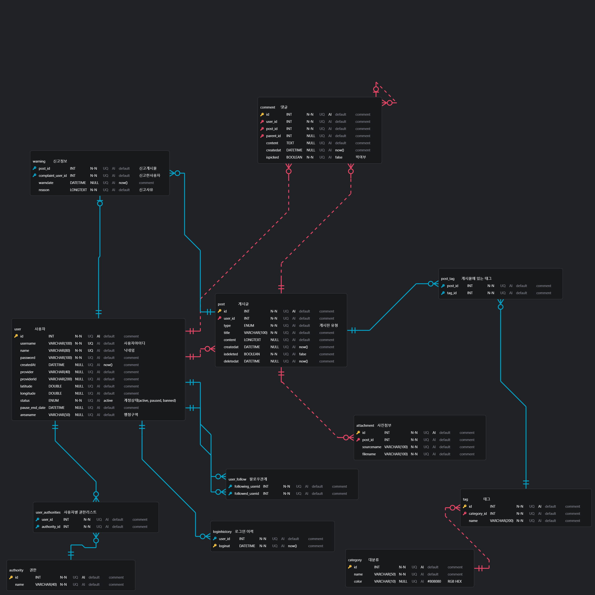
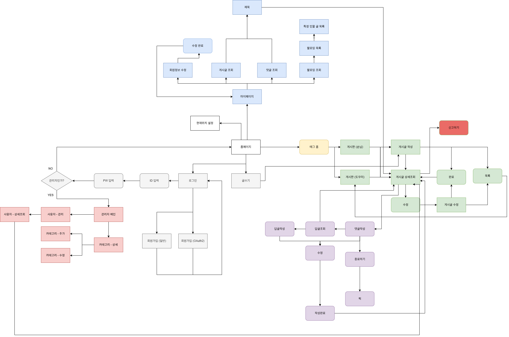

# 🚀 프로젝트 명: ROOFY (위치 기반 커뮤니티)

"한 지붕(지역) 아래 사람을 연결한다"

---

## 📖 프로젝트 소개
커뮤니티 활동을 하다 보면 다양한 게시판, 수많은 게시글, 사용자들 속에서 길을 잃기 쉽습니다. 따라서 사용자들이 편리하게 사용하면서 건강한 소통을 할 수 있는 커뮤니티 서비스를 만들고자 하였습니다.

## 📅 개발 기간
* 2025.05.01 ~ 2025.06.05

## 🧑‍🤝‍🧑 멤버
* **김지우(팀장)**
  * Spring Security를 이용한 OAuth2 기반 로그인/로그아웃 및 회원가입 구현
  * 해시태그 기반 검색 및 태그 생성이 가능한 템플릿 구현
  * Geocoder/Geolocation/Google Map API 를 활용한 사용자 위치 설정
  * 사용자 위치 기반 거리별 게시물 조회
  * 관리자 페이지 - 사용자 신고 상세 내역 및 이에 따른 계정 상태 관리
  * Github 세팅 및 관리
  * EC2 및 RDS 를 활용한 AWS 배포

* **김충희** 
  * 게시판 유형에 따른 게시판 및 게시물의 CRUD 구현
  * 사용자 간 신고 및 팔로우 관계 기능 구현
  * 태그 템플릿과 게시판 CRUD 연동

* **김현구**
  * ThymeLeaf Security 를 이용한 헤더 구현
  * AJAX 기반 댓글/대댓글 CRUD 및 댓글 PICK 기능 구현
  * 마이페이지(내가 작성한 게시물, 댓글, PICK한 댓글, 팔로잉 목록 조회 & 회원정보 수정) 구현

* **손범규**
  * pagination 구현
  * 게시물 첨부파일 CRUD 구현
  * 관리자페이지 - 카테고리 관리
  * 전체 CSS

## 🛠️ 기술 스택 (Tech Stack)

### Backend
<li>
IDE: IntelliJ
</li>
<li>
Java 17, Spring Boot 3.4.4, Spring security, Spring Web, Mybatis, gradle, Thymeleaf
</li>

### Frontend
<li>HTML5, CSS3, bootstrap 5.3.0, jQuery 3.7.0, ajax, chart.js</li>

### Database & Cloud
<li>MySQL, AWS EC2 & RDS</li>

### Location & Map API
<li>Google Maps, Geolocation, Geocoder API</li>

### Tools & Etc
<li>PostMan, DrawIO</li>

## 🔧 아키텍처 (Architecture)

### DB 구조 (ERD)

### 화면 흐름도

## 🔗 링크
* **시연 영상:** [YouTube 링크](https://www.youtube.com/watch?v=S6Q-LdETwic&list=PLedGoSru794_lz0PHBO9FshQEC-O5IpYm&index=3)